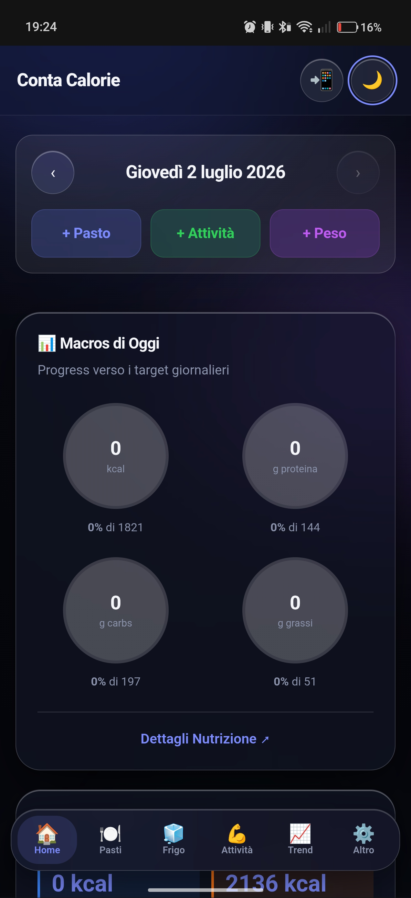
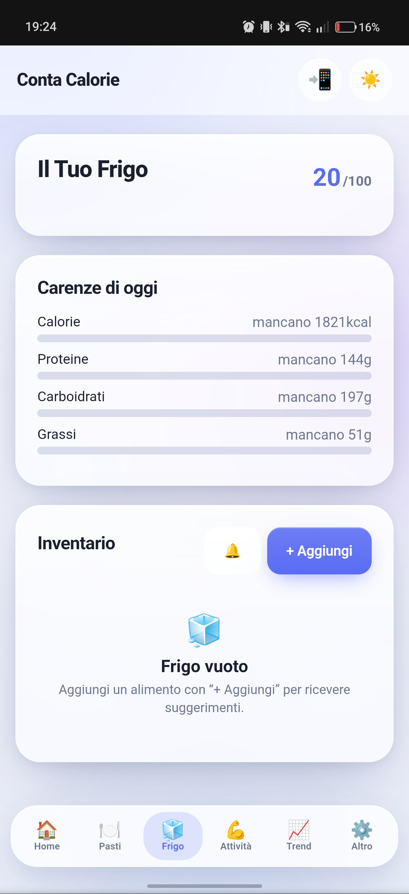
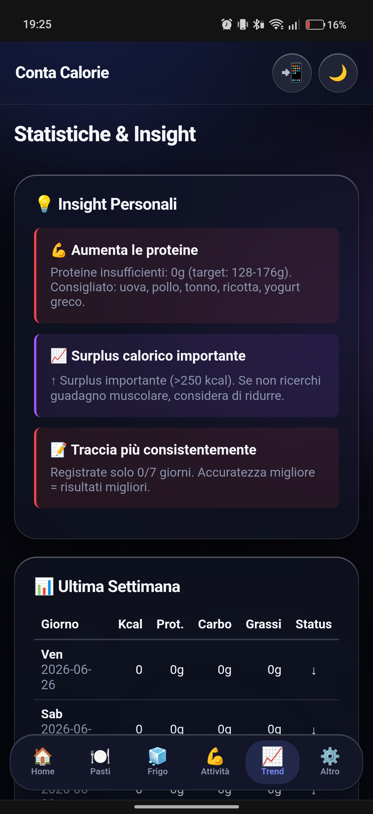
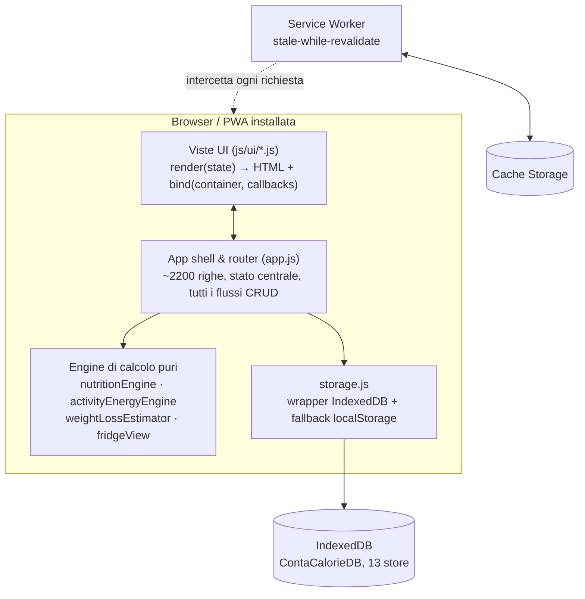
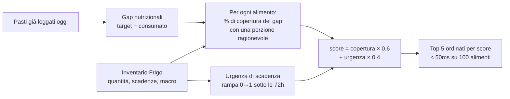
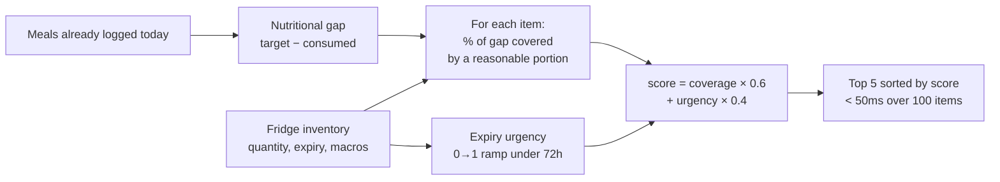

<div align="center">

# 🧮 Conta Calorie

**A production PWA for nutrition tracking — 100% client-side, offline-first, zero dependencies.**

[](./tests)
[](./package.json)
[](#-installazione--installation)
[](#stack-tecnico--tech-stack)
[](#sotto-il-cofano--under-the-hood)

[Italiano](#italiano) · [English](#english)

</div>

---

<p align="center">
  
  
  
</p>

<p align="center"><sub>Screenshot reali dall'app installata su telefono — non mockup.</sub></p>

<p align="center"><sub>🤖 Codice scritto interamente da Claude (Anthropic), sotto supervisione umana obbligatoria ad ogni step — vedi <a href="#processo-ai-supervisionato">più sotto</a> / <a href="#ai-assisted-process-with-mandatory-human-review">below</a>.</sub></p>

---

# Italiano

## Cosa fa

Conta Calorie è un'app per il tracking di pasti, macro, allenamenti, peso e composizione
corporea. Non è un progetto-esercizio: è un'app usata ogni giorno, installata come PWA
sul telefono, cresciuta per iterazioni reali basate su bug e richieste reali (uno dei
fix descritti sotto è nato da uno screenshot inviato da telefono durante l'uso normale
dell'app).

- **Tracking pasti** — ricerca su un database di ~900 alimenti italiani (dataset CREA),
  alimenti personalizzati, stima rapida senza dati precisi, pasti composti da più
  ingredienti.
- **Target energetici personalizzati** — calcolo BMR (Mifflin-St Jeor), TDEE per livello
  di attività, macro-target adattati all'obiettivo (dimagrimento / mantenimento / massa).
- **Il Tuo Frigo** — inventario con scadenze, calcolo del deficit nutrizionale del
  giorno in tempo reale, e un motore di suggerimento che propone cosa mangiare dal
  frigo per colmare le carenze (vedi sotto per come funziona davvero).
- **Allenamenti** — sessioni pesi (con esercizi dettagliati o rapide), cardio, passi,
  stima calorica con modelli MET/ACSM, sync opzionale da provider esterni.
- **Composizione corporea e trend** — proiezioni di peso, stima massa magra/grassa da
  baseline, insight settimanali generati da regole (es. "di solito non raggiungi le
  proteine la sera").
- **Tema chiaro/scuro** — segue il tema di sistema di default, la scelta esplicita
  dell'utente ha sempre la precedenza e resta salvata.
- **Backup/restore completo** — export/import JSON di tutti i dati locali.
- **Offline al 100%** — service worker con caching intelligente, funziona su un volo
  senza wifi tanto quanto sulla fibra di casa.

## Com'è fatto

Nessun framework, nessuna build step, nessun bundler. Moduli ES6 nativi, caricati
direttamente dal browser. La scelta non è nostalgia: è stata una decisione deliberata
per tenere il codice leggibile, il peso della pagina minimo, e zero superficie di attacco
da dipendenze di terze parti.



Ogni vista è una coppia di funzioni pure: `render(state) → stringa HTML` e
`bind(container, callbacks) → collega gli eventi`. Gli engine di calcolo (TDEE, macro,
punteggi del frigo, stime di composizione corporea) sono funzioni pure testabili in
isolamento, senza toccare il DOM o il DB.

## L'"intelligenza" del Frigo — come funziona davvero

Voglio essere preciso qui, non voglio vendere fumo: **non c'è machine learning in questa
app**. Il motore di suggerimento del Frigo è un algoritmo di scoring deterministico,
non un modello addestrato. Lo descrivo comunque perché è il pezzo di logica più
interessante del progetto, ed è comunque territorio "AI-adjacent" — ranking, scoring
multi-obiettivo, ottimizzazione vincolata — solo senza inferenza statistica.



Stesso approccio per: la lista della spesa (ricava gli alimenti più ricchi del macro
carente in modo cronico, guardando 7 giorni di storico), il matching ricette↔frigo
(per id o per nome normalizzato), e lo score giornaliero (media pesata di
completezza-macro, varietà alimentare, utilizzo prima della scadenza).

## Processo AI-supervisionato

**Tutto il codice di questo repository è stato scritto da Claude (Anthropic).** Il mio
contributo umano è: idee e requisiti di prodotto, direzione su cosa costruire e in che
ordine, screenshot e bug report da uso reale dell'app, e — punto non negoziabile —
**revisione e test manuali obbligatori prima di ogni commit**. Nessuna modifica è mai
stata accettata senza che io la verificassi di persona nell'app funzionante.

Questo non è "ho chiesto a un chatbot di scrivere del codice". È un processo con
verifica strutturata:

1. **5 agenti Claude in parallelo** hanno documentato ogni funzione dell'app
   (dati/persistenza, motori di calcolo, routing, UI, design system) — cosa fa e a cosa
   serve, con riferimenti file:riga.
2. **3 agenti di verifica indipendenti**, che non avevano scritto l'analisi, hanno
   riletto ogni singola affermazione contro il codice sorgente reale — non fiducia nel
   documento, verifica riga per riga. Hanno anche trovato errori nell'analisi stessa.
3. Il bilancio finale (2 bug critici, 15 medi, ~32 minori) è stato corretto da Claude,
   e **verificato da me** in browser prima di ogni commit — nessuna correzione è
   arrivata su `main` senza controllo umano.

Report completi in [`docs/APP_ANALYSIS.md`](docs/APP_ANALYSIS.md) e
[`docs/verification/`](docs/verification/) — non affermazioni, evidenza file:riga
verificabile da chiunque.

Un esempio concreto di bug trovato così: un mismatch tra `totaleCarboidrati` e
`totaleCarbo` (due nomi diversi per lo stesso dato) produceva `NaN` silenzioso in ogni
riga delle statistiche settimanali/mensili — nessun errore in console, solo un numero
sbagliato in UI. Un altro, non trovato da un agente ma da uno screenshot reale inviato
durante l'uso normale dell'app: il database alimentare usa nomi tipo
`"Pollo, petto, crudo"` (virgole comprese), e l'indicizzazione per la ricerca non
rimuoveva la punteggiatura — il 64% degli alimenti del database (577 su 900) era di
fatto irraggiungibile da query multi-parola. Root cause isolata da Claude, verificata
con uno script che replica l'algoritmo reale contro i dati reali, poi corretta —
e ri-testata a mano prima del commit.

## Qualità

54 test automatici (`node --test`, zero framework esterni) sulle funzioni pure — motori
di calcolo, algoritmo di suggerimento del frigo, normalizzazione dati.

## Cosa NON fa (onestà prima di tutto)

- **Nessun machine learning, nessuna chiamata a LLM in produzione.** I suggerimenti sono
  scoring deterministico, non inferenza statistica. Se cerchi un progetto con modelli
  addestrati o integrazione LLM runtime, non è questo (ma leggi sopra: il *processo* di
  audit sì).
- **Nessun backend, nessun account, nessun multi-dispositivo.** Tutto vive nel browser
  dell'utente (IndexedDB). Cambiare dispositivo richiede export/import manuale del
  backup JSON.
- **Database alimentare in italiano, dataset CREA.** Non c'è integrazione con Open Food
  Facts o altre API esterne (una vecchia versione del progetto la prevedeva, non più).
- **Utente singolo per installazione.** Nessuna sincronizzazione multi-utente o
  condivisione dati.
- **Nessuna licenza dichiarata al momento** — repo pubblico per scopi di portfolio,
  non ancora pensato per essere riusato/forkato in produzione da terzi.

## Stack tecnico

| | |
|---|---|
| Frontend | JavaScript vanilla, ES modules, nessun framework |
| Persistenza | IndexedDB (con fallback localStorage), schema versionato con migrazioni |
| Offline | Service Worker, strategia stale-while-revalidate |
| Stile | CSS custom properties, dark/light theming, glassmorphism con budget GPU per mobile |
| Test | `node --test` nativo, 54 test su funzioni pure |
| Deploy | Vercel, statico, auto-deploy su push |
| Dipendenze runtime | **zero** |

## Installazione / Installazione locale

```bash
git clone https://github.com/Moriconz/ContaCalorie.git
cd ContaCalorie
npm start          # server statico locale (server.cjs)
# apri http://localhost:3000
```

Per installarla come PWA: apri l'URL da Chrome (Android) o Safari (iOS) e usa
"Aggiungi alla schermata Home" — funziona offline dal primo avvio.

```bash
npm test            # esegue i 54 test automatici
```

---

# English

## What it does

Conta Calorie is a nutrition, workout, weight and body-composition tracking app. It's
not a tutorial project — it's an app used daily, installed as a PWA, and it has grown
through real iteration on real bugs and real requests (one of the fixes described
below started as a screenshot sent during normal daily use of the app).

- **Meal tracking** — search across a ~900-item Italian food database (CREA dataset),
  custom foods, quick estimates without exact label data, multi-ingredient composed
  meals.
- **Personalized energy targets** — BMR (Mifflin-St Jeor equation), TDEE by activity
  level, macro targets adapted to the user's goal (cut / maintain / bulk).
- **"Il Tuo Frigo" (Your Fridge)** — inventory with expiry tracking, real-time daily
  nutritional-gap calculation, and a suggestion engine that recommends what to eat from
  your fridge to close today's gaps (see below for exactly how it works).
- **Workout tracking** — strength sessions (quick or exercise-by-exercise), cardio,
  step tracking, calorie estimation via MET/ACSM models, optional external provider
  sync.
- **Body composition & trends** — weight projections, lean/fat mass estimates from a
  baseline, rule-generated weekly insights (e.g. "you usually fall short on protein in
  the evening").
- **Dark/light theme** — defaults to the OS preference; an explicit user choice always
  wins and persists.
- **Full backup/restore** — JSON export/import of all local data.
- **100% offline-capable** — service worker with smart caching; works on a plane with
  no wifi the same way it works on fiber at home.

## Architecture

No framework, no build step, no bundler. Native ES6 modules, loaded straight by the
browser. That's not nostalgia — it was a deliberate choice to keep the code readable,
the page weight minimal, and the third-party dependency attack surface at zero.


Every view is a pair of pure functions: `render(state) → HTML string` and
`bind(container, callbacks) → wires events`. The calculation engines (TDEE, macros,
fridge scoring, body-composition estimates) are pure, independently testable functions
that never touch the DOM or the database.

## The Fridge's "intelligence" — how it actually works

I want to be precise here, not sell smoke: **there is no machine learning in this app.**
The Fridge suggestion engine is a deterministic scoring algorithm, not a trained model.
I'm describing it anyway because it's the most interesting piece of logic in the
project, and it's still AI-adjacent territory — ranking, multi-objective scoring,
constrained optimization — just without statistical inference.



Same approach for: the shopping list (derives the foods richest in whatever macro is
chronically deficient, looking at 7 days of history), recipe↔fridge matching (by id or
normalized name), and the daily score (weighted average of macro completeness, food
variety, and pre-expiry usage).

## AI-assisted process with mandatory human review

**Every line of code in this repository was written by Claude (Anthropic).** My human
contribution is: product ideas and direction, prioritization, screenshots and bug
reports from real daily use of the app, and — non-negotiable — **mandatory manual
review and testing before every commit**. No change was ever accepted without me
verifying it myself in the working app.

This isn't "I asked a chatbot to write some code." It's a process with structured
verification:

1. **5 Claude agents in parallel** documented every function in the app
   (data/persistence, calculation engines, routing, UI, design system) — what it does
   and why, with file:line references.
2. **3 independent verification agents**, none of which had written the analysis,
   re-checked every single claim against the real source code — not trust in the
   document, line-by-line verification. They also caught errors in the analysis itself.
3. The final tally (2 critical bugs, 15 medium, ~32 minor) was fixed by Claude, and
   **verified by me** in the browser before every commit — nothing reached `main`
   without human review.

Full reports in [`docs/APP_ANALYSIS.md`](docs/APP_ANALYSIS.md) and
[`docs/verification/`](docs/verification/) — not claims, file:line evidence anyone can
check.

One concrete bug found this way: a mismatch between `totaleCarboidrati` and
`totaleCarbo` (two different names for the same field) silently produced `NaN` in every
row of the weekly/monthly stats — no console error, just a wrong number in the UI.
Another one, not found by an agent but by an actual screenshot sent during normal daily
use of the app: the food database uses names like `"Pollo, petto, crudo"` (commas
included), and the search index wasn't stripping punctuation before tokenizing — 64% of
the food database (577 of 900 items) was effectively unreachable from any multi-word
query. Claude isolated the root cause, verified it with a script that replicated the
real algorithm against the real data, then fixed it — and it was re-tested by hand
before the commit.

## Quality

54 automated tests (`node --test`, zero external test frameworks) on the pure
functions — calculation engines, the fridge suggestion algorithm, data normalization.

## What it does NOT do (honesty first)

- **No machine learning, no LLM calls at runtime.** Suggestions are deterministic
  scoring, not statistical inference. If you're looking for a project with trained
  models or a runtime LLM integration, this isn't it (but see above: the *engineering
  process* used to build it is).
- **No backend, no accounts, no multi-device sync.** Everything lives in the user's
  browser (IndexedDB). Switching devices requires a manual JSON backup export/import.
- **Italian-language food database, CREA dataset.** No Open Food Facts or other
  external API integration (an early version of the project had this, no longer does).
- **Single user per install.** No multi-user sync or data sharing.
- **No license declared yet** — public repo for portfolio purposes, not yet set up to
  be reused/forked in production by third parties.

## Tech stack

| | |
|---|---|
| Frontend | Vanilla JavaScript, ES modules, no framework |
| Persistence | IndexedDB (with localStorage fallback), versioned schema with migrations |
| Offline | Service Worker, stale-while-revalidate strategy |
| Styling | CSS custom properties, dark/light theming, glassmorphism with a mobile GPU budget |
| Testing | Native `node --test`, 54 tests on pure functions |
| Deploy | Vercel, static, auto-deploy on push |
| Runtime dependencies | **zero** |

## Getting started

```bash
git clone https://github.com/Moriconz/ContaCalorie.git
cd ContaCalorie
npm start          # local static server (server.cjs)
# open http://localhost:3000
```

To install as a PWA: open the URL in Chrome (Android) or Safari (iOS) and use "Add to
Home Screen" — it works offline from the very first launch.

```bash
npm test            # runs the 54 automated tests
```

---

<div align="center">

Idea, direzione e supervisione: **Riccardo Moricone** — [LinkedIn](https://www.linkedin.com/in/riccardo-moricone-0b3426157/)
Codice: Claude (Anthropic)

</div>
